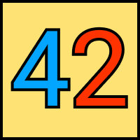
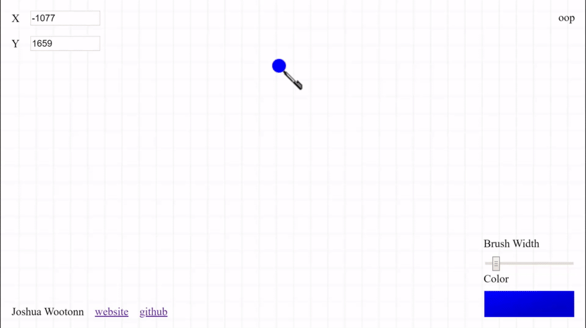

MSPaint esthetics, Figma collaboration, and PostGis Geospatial storage all make for a collaborative doodling environment ✒

**built with:**
* [PostGis](https://postgis.net/) 
* [.Net Core](https://docs.microsoft.com/en-us/dotnet/core/) 
* [Typescript](https://www.typescriptlang.org/) 
* [React](https://reactjs.org/) 
* [Love](https://www.loves.com/) 

**demo: ** 
